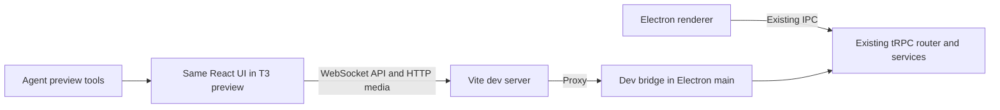

# Browser development and agent verification: adopting T3 Code's approach

Research date: 2026-10-02. Sources: the local T3 Code checkout at `d5980a0ff` and Linux Wallpaper Engine at `27cb7f9`, plus the official tRPC documentation. This is an adoption proposal; the application changes and commands below are not implemented.

The useful pattern is one frontend that works in a regular browser and the desktop shell, with the browser talking to the application's real backend. T3 Code separately provides the shared browser and agent inspection tools. For this project, start by adding a development bridge to the existing Electron backend and use T3's existing preview tools to verify the UI.

## What T3 Code actually does

- **A web frontend and a separate backend.** Its development instructions distinguish `dev` (server and web), `dev:desktop` (Electron), and separate server/web processes. Electron loads an application URL. See [development modes](/home/jagrat/dev/t3code/docs/operations/development.md:18), [desktop URL loading](/home/jagrat/dev/t3code/apps/desktop/src/window/DesktopWindow.ts:370), and [loadURL](/home/jagrat/dev/t3code/apps/desktop/src/window/DesktopWindow.ts:702).
- **One browser origin in web development.** Vite proxies backend paths, including WebSocket upgrades. The browser can use its current origin instead of compiling in a particular backend hostname. See [Vite proxy](/home/jagrat/dev/t3code/apps/web/vite.config.ts:239) and [development guidance](/home/jagrat/dev/t3code/docs/operations/development.md:44).
- **Separate development state and ports.** The runner chooses ports and a development data directory, with worktree-specific defaults. See [state and ports](/home/jagrat/dev/t3code/docs/operations/development.md:27) and [runner configuration](/home/jagrat/dev/t3code/scripts/dev-runner.ts:310).
- **Agent tools for a shared browser.** `preview_open`, `preview_navigate`, `preview_snapshot`, and interaction tools are MCP tools. Their handlers invoke a broker that routes requests to a connected automation host. See [tool definitions](/home/jagrat/dev/t3code/apps/server/src/mcp/toolkits/preview/tools.ts:53), [handler](/home/jagrat/dev/t3code/apps/server/src/mcp/toolkits/preview/handlers.ts:65), and [broker routing](/home/jagrat/dev/t3code/apps/server/src/mcp/PreviewAutomationBroker.ts:541).
- **The automation host is Electron in this checkout.** The frontend's automation host is enabled only when Electron and the preview automation bridge are present. Running T3's web frontend alone does not create this host. See [host guard](/home/jagrat/dev/t3code/apps/web/src/components/preview/PreviewAutomationHosts.tsx:276).
- **Chromium inspection and semantic targeting.** The desktop preview attaches Electron's debugger directly, enables runtime/accessibility/network/log inspection, and uses Playwright's injected selector runtime. This is an embedded browser controller, rather than a separate Playwright browser launch. See [debugger setup](/home/jagrat/dev/t3code/apps/desktop/src/preview/Manager.ts:1401) and [selector runtime loading](/home/jagrat/dev/t3code/apps/desktop/src/preview/PlaywrightInjectedRuntime.ts:165).
- **Evidence beyond a screenshot.** A snapshot includes page text, interactive elements, the accessibility tree, console entries, network entries, action history, and a PNG. See [snapshot collection and result](/home/jagrat/dev/t3code/apps/desktop/src/preview/Manager.ts:3716).

The T3 preview MCP tools are exposed to the current agent session. That establishes that the interface is available; no browser was opened or tested during this research.

## What prevents our UI from working in a browser today

| Boundary | Current implementation | Change needed for browser development |
| --- | --- | --- |
| Renderer API | [tRPC client](/home/jagrat/dev/linux-wallpaper-engine/src/renderer/lib/trpc.ts:17) always uses `ipcLink()`. The dependency [requires the preload global](/home/jagrat/dev/linux-wallpaper-engine/node_modules/trpc-electron/dist/renderer.mjs:140). | Select IPC for Electron and a network transport for the browser before creating the client. |
| Backend entry point | [Main process](/home/jagrat/dev/linux-wallpaper-engine/src/main/main.ts:176) exposes the existing router over IPC. | Expose that same router through a development-only WebSocket listener. |
| Images and previews | [Wallpaper hook](/home/jagrat/dev/linux-wallpaper-engine/src/renderer/hooks/use-wallpapers.ts:131), [display page](/home/jagrat/dev/linux-wallpaper-engine/src/renderer/routes/displays.tsx:48), [background context](/home/jagrat/dev/linux-wallpaper-engine/src/renderer/contexts/wallpaper-background-context.tsx:24), and [playlist row](/home/jagrat/dev/linux-wallpaper-engine/src/renderer/components/playlist/playlist-row.tsx:159) construct `local-file://` URLs. The scheme is registered in [Electron main](/home/jagrat/dev/linux-wallpaper-engine/src/main/main.ts:157). | Centralize URL construction; use HTTP media URLs in the browser. |
| Live updates | [Global invalidation](/home/jagrat/dev/linux-wallpaper-engine/src/renderer/hooks/use-invalidation.ts:3) and [Workshop connection events](/home/jagrat/dev/linux-wallpaper-engine/src/main/trpc/routes/workshop.ts:32) are subscriptions. | Carry subscriptions over the browser transport, including reconnect and cleanup. A queries-only HTTP bridge is insufficient. |
| Desktop functions | [Window routes](/home/jagrat/dev/linux-wallpaper-engine/src/main/trpc/routes/window.ts:1), [version lookup](/home/jagrat/dev/linux-wallpaper-engine/src/main/trpc/routes/app.ts:13), and [autostart](/home/jagrat/dev/linux-wallpaper-engine/src/main/utils/autostart.ts:1) depend on Electron. | Keep the backend in Electron initially; handle browser link/window behavior by surface. |
| Persistent state | [Store service](/home/jagrat/dev/linux-wallpaper-engine/src/main/services/store.ts:30) eagerly creates Electron stores. [Wallpaper startup](/home/jagrat/dev/linux-wallpaper-engine/src/main/services/wallpaper/wallpaper.ts:52) can synchronize/reapply saved active wallpapers. | Choose isolated development storage before importing services that initialize stores or restore state. |

The [renderer Vite configuration](/home/jagrat/dev/linux-wallpaper-engine/vite.renderer.config.mts:8), [HTML entry](/home/jagrat/dev/linux-wallpaper-engine/index.html:9), and [React bootstrap](/home/jagrat/dev/linux-wallpaper-engine/src/renderer/renderer.tsx:11) already provide the frontend foundations. The API transport and media URLs are the main browser blockers.

## Recommended first implementation

1. **Add a browser transport alongside IPC.** Preserve `AppRouter` inference and the existing React Query hooks. For the initial bridge, `createWSClient` / `wsLink` can carry queries, mutations, and subscriptions. The official [tRPC WebSocket guide](https://trpc.io/docs/server/websockets) documents the server's `applyWSSHandler` and client configuration. The installed [WebSocket adapter](/home/jagrat/dev/linux-wallpaper-engine/node_modules/@trpc/server/src/adapters/ws.ts:315) handles observable subscriptions, matching our current routes.
2. **Host the bridge inside the existing Electron main process.** Enable it explicitly in development, bind it to loopback, and use the existing `appRouter` and services. Add an HTTP endpoint for wallpaper media, resolved against wallpaper/fixture roots. This avoids immediately extracting Electron-dependent persistence, app metadata, autostart, and native integrations into a separate Node server.
3. **Proxy API and media through Vite.** Add a WebSocket-enabled API proxy and an HTTP media proxy to the renderer config. Derive the browser WebSocket URL from the page origin. Keep the same renderer entry, route tree, and components.
4. **Add one shared media URL helper.** Replace all four areas that construct `local-file://` URLs. Preserve already-valid remote Workshop URLs and support local thumbnail and preview files. Media responses should have correct content types and support ranges where previews need them.
5. **Provide a proposed `dev:web` command.** It should start the existing Electron backend with the bridge enabled and the Vite renderer, print the actual browser URL/port, and clean up the processes it owns. The backend still runs under Electron in this first phase. Keep ordinary desktop development available for native integration checks.
6. **Give development its own state.** Establish a development store directory before eager service imports; review startup reapply and autostart behavior. This isolates app stores, but does not by itself isolate Steam's external playlist files or desktop process actions. Browser tests that exercise those paths need fixtures or intentionally selected real integration data.

Use [the existing router types](/home/jagrat/dev/linux-wallpaper-engine/src/main/trpc/router.ts:24) and [shared constants](/home/jagrat/dev/linux-wallpaper-engine/src/shared/constants/app.ts:10) rather than defining parallel browser versions of settings, wallpaper, display, or playlist types.

## Agent verification after implementation

Once browser use is requested, an agent can start the proposed dev command, call `preview_status`, open a preview if needed, and navigate using `{ target: { kind: 'environment-port', port: <actual-port> } }`. It can inspect a snapshot, interact through semantic locators, check the resulting page and diagnostics, resize the viewport, and capture evidence. T3 already owns the browser controller and MCP integration; the wallpaper application only needs to provide a working web URL.

The first acceptance checks should exercise an actual query, a persisted settings mutation, local thumbnail/preview loading, an invalidation subscription, and Workshop connection events. Check reconnect behavior and browser-specific external links as well. A browser pass can establish frontend behavior; Electron tray behavior, autostart, native Steam integration, and rendered wallpapers still need desktop integration verification.

After the real bridge works, add deterministic service fixtures for empty/populated libraries, multiple displays, missing-backend errors, and disconnected Workshop states. Fixtures should follow the same route contracts and emit the same subscription events, including mutation effects. Extract a standalone Node backend later if development without Electron or a supported web product becomes a goal.
